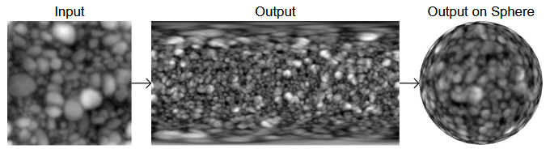
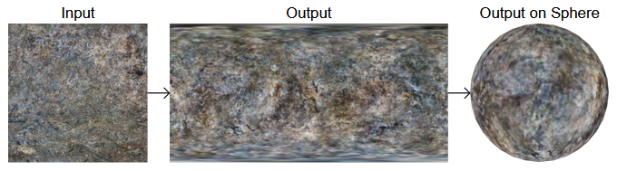
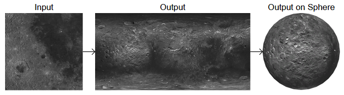
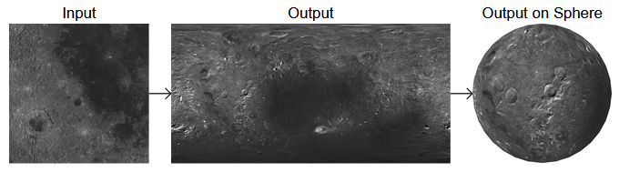
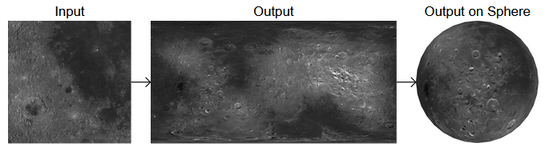

# Spherical Stochastic Texturing

This algorithm generates random textures for spheres from example inputs.
It was inspired by [Procedural Stochastic Texturing](https://github.com/UnityLabs/procedural-stochastic-texturing).

You can try out the web demo [here](https://danielklisch.github.io/spherical_stochastic_texturing/).

## Examples

Spherical Stochastic Texturing can be used to seamlessly project textures onto spheres:

It can also be used to generate random variations from a single input:

For the first examples textures from [shadertoy](https://www.shadertoy.com/view/tdSSzV) were used.
The [map of the moon](https://trek.nasa.gov/moon/) came from NASA.

## How It Works

Spherical Stochastic Texturing works similarly to the original [Procedural Stochastic Texturing](https://github.com/UnityLabs/procedural-stochastic-texturing):
It interpolates between patches that are sampled at grid points.
However, instead of a flat triangular grid, Spherical Stochastic Texturing uses the vertices of a subdivided cube projected onto a sphere.
The size of the patches can be adjusted using the "Texture Scale" parameter, and the grid resolution using the "Grid Scale" parameter.
Since the blending of patches changes the color distribution, [Histogram Transfer](https://github.com/danielklisch/histogram_transfer) can be used to match the original distribution.
